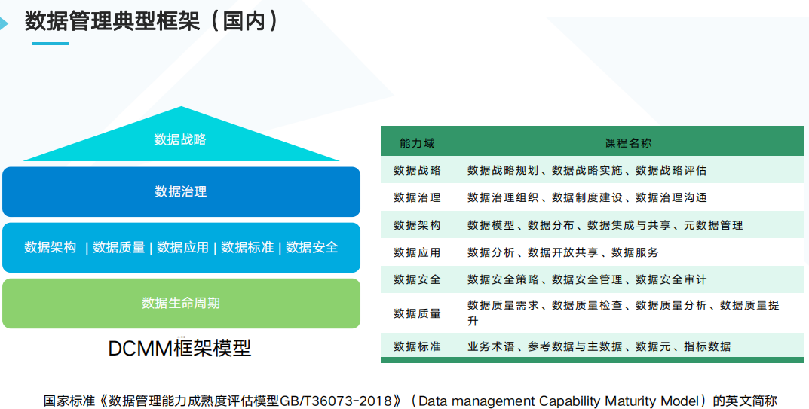

[TOC]

## 数据治理的概念

> 数据管理典型框架(国外)

> 数据管理典型框架(国内)

* 总结
    * 数据治理, 数据管理, 数据中台, 数据资产管理
    * 以上都只是各个公司厂家的一些概念, 本质上都是为了将不同类型, 业务系统的数据源, 比如结构化数据, 非结构化数据, 半结构化数据, 互联网数据等数据, 接入到数据中台, 然后经过各种计算处理, 通过服务调用等方式输出到大屏, 用户画像, 健康码等数据应用
      * 将数据变成数据资产, 从而更好的去支持上层业务应用