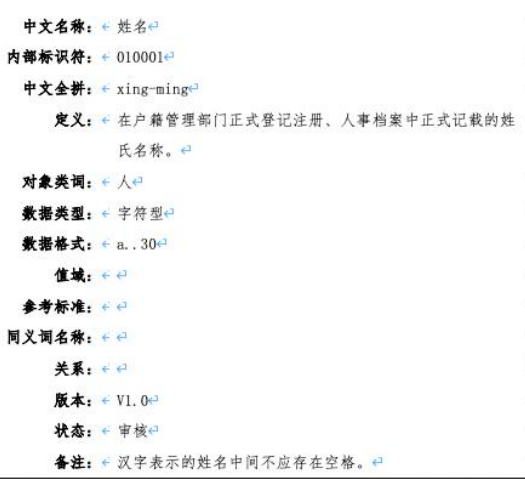
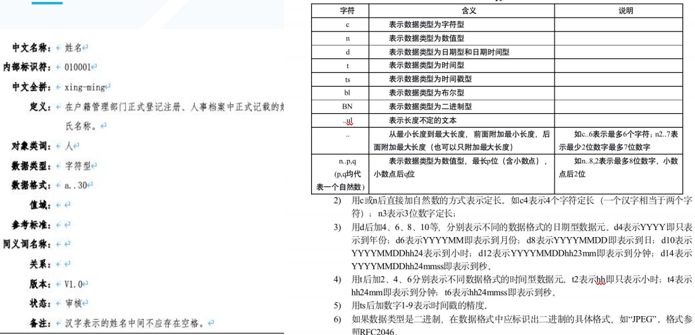
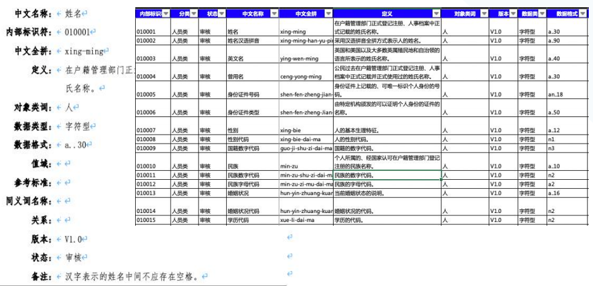
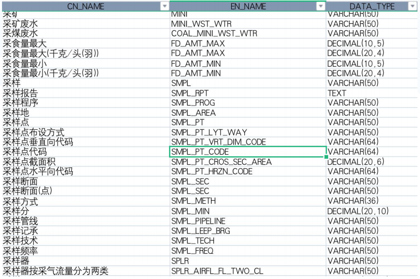
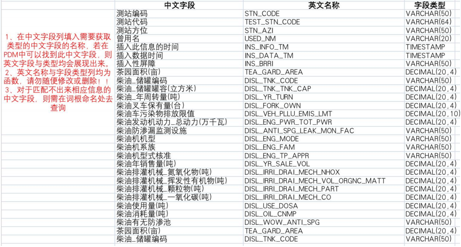
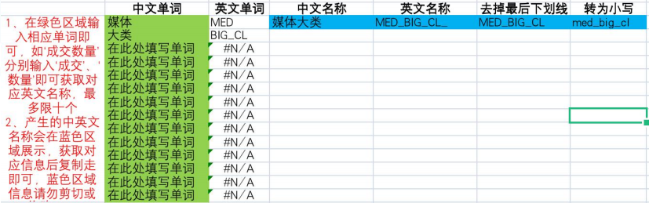
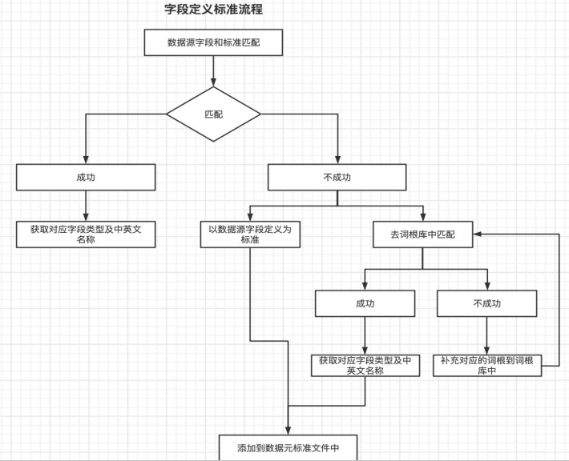

[TOC]

## 目的与意义
* 将无序的数据, 通过一些标准, 比如数仓层级命名, 主题域命名, 表命名, 脚本和工作流命名, 以及字段标准, 数据标准, 代码表标准, 代码标准, 变成统一标准实现的可流通, 可辨识的数据资产

## 6大数据标准

### 数据元

概括: 是一个表字段命名的标准, 为了统一数仓建模表字段的命名

> 数据元概念

* 数据元 data element
    * DE 由一组属性规定其定义、标识、  表示和允许值的数据单元。  ——GB/T 18391.1-2019
    * 描述数据最小的一个单元或者单元集, 约等于字段的描述, 如下是name字段的数据元

* 数据源标准的分类分别有
    * 国家标准
    * 行业标准
    * 地方标准
    * 团队标准
    * 企业标准
    * 学协会

> 数据元属性

> 怎么使用

1. 先从国标或者地方网站下载数据标准文档, 将标准文档内容信息化

2. 转化数据类型和中、英文命名形成可用的数据元标准

   
3. 将建模字段和数据元标准匹配

   
4. 无法匹配的字段在词根库中二次匹配生成新的数据元标准, 并添加到标准文档中

字段定义标准流程

### 分类与编码--代码

### 分类与编码--编码规则

### 信息资源目录

### 命名规范

### 开发规范
