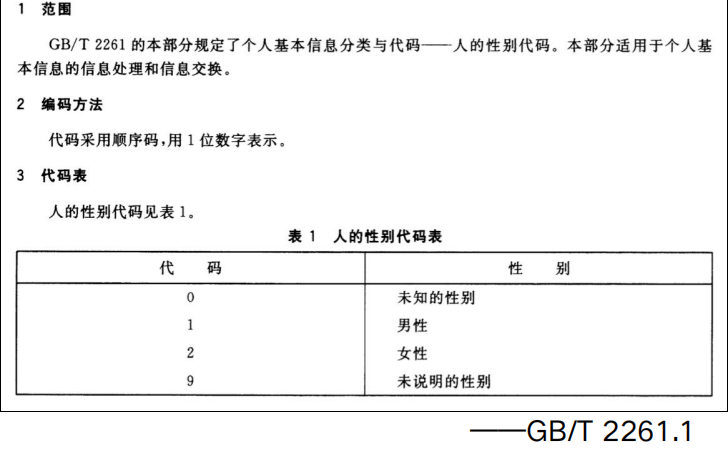
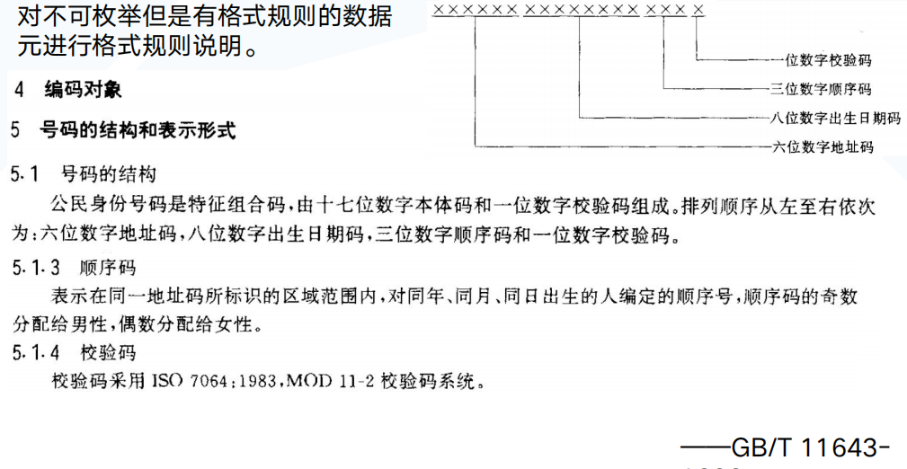
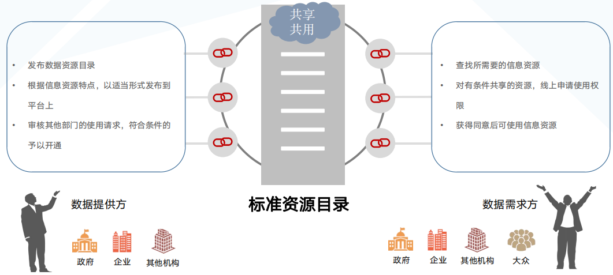
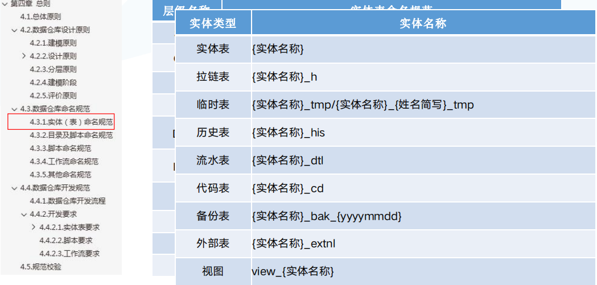
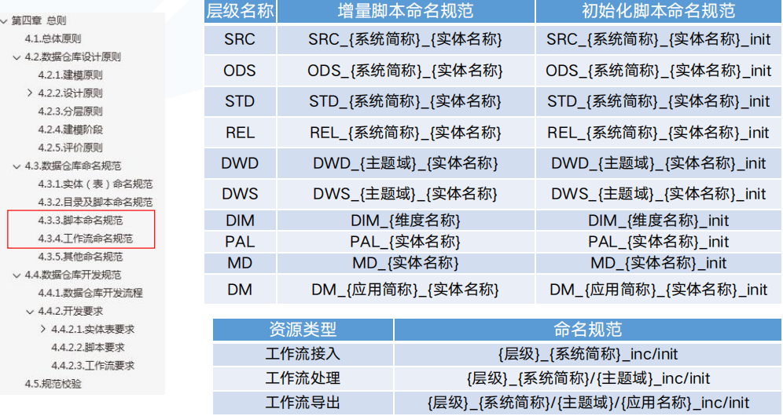
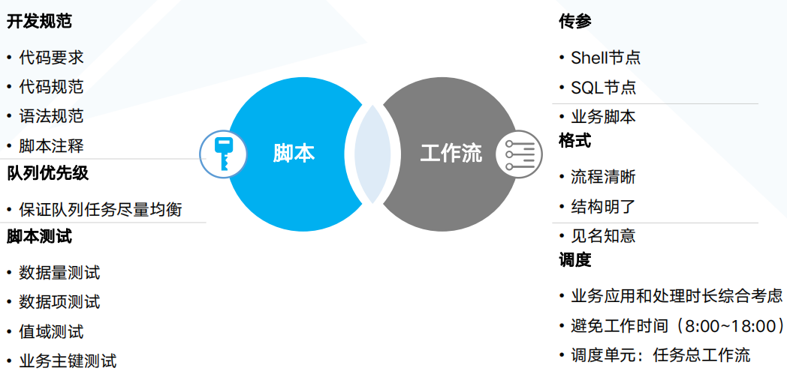

[TOC]

## 目的与意义
* 将无序的数据, 通过一些标准, 比如数仓层级命名, 主题域命名, 表命名, 脚本和工作流命名, 以及字段标准, 数据标准, 代码表标准, 代码标准, 变成统一标准实现的可流通, 可辨识的数据资产

## 6大数据标准

### 数据元

概括: 是一个表字段命名的标准, 为了统一数仓建模表字段的命名

> 数据元概念

* 数据元 data element
    * DE 由一组属性规定其定义、标识、  表示和允许值的数据单元。  ——GB/T 18391.1-2019
    * 描述数据最小的一个单元或者单元集, 约等于字段的描述, 如下是name字段的数据元


* 数据源标准的分类分别有
    * 国家标准
    * 行业标准
    * 地方标准
    * 团队标准
    * 企业标准
    * 学协会

> 数据元属性


> 怎么使用


1. 先从国标或者地方网站下载数据标准文档, 将标准文档内容信息化


2. 转化数据类型和中、英文命名形成可用的数据元标准

   
3. 将建模字段和数据元标准匹配

   
4. 无法匹配的字段在词根库中二次匹配生成新的数据元标准, 并添加到标准文档中


字段定义标准流程

### 分类与编码--代码

对可枚举数据元枚举值进行列举，并对每个值进行编码


使用上也是先下载标准文件, 然后将标准文件信息化, 最后对数据源数据使用代码的标准编码做数据清洗

### 分类与编码--编码规则

对不可枚举但是有格式规则的数据元进行格式规则说明


使用上也是先下载标准文件, 然后将标准文件信息化, 并将各种规则转换成正则表达式, 处理过程中将数据先验证再按编码规则转换

```sql
-- 日期时间规整（全）：
case when s.JFRQ = 'null' then null when trim(s.JFRQ) rlike '^[0-9]{6}$' then
from_unixtime(unix_timestamp(s.JFRQ,'yyyyMM'),'yyyy-MM')
when trim(s.JFRQ) rlike '^[0-9]{8}$' then
from_unixtime(unix_timestamp(s.JFRQ,'yyyyMMdd'),'yyyy-MM-dd')
when trim(s.JFRQ) rlike '^[0-9]{14}$' then
from_unixtime(unix_timestamp(s.JFRQ,'yyyyMMddHHmmss'),'yyyy-MM- dd HH:mm:ss')
else s.JFRQ end JFRQ, 电话号码按照编码规则转换


--- 电话号码按照编码规则转换：
case when trim(s.lxdh) rlike '^([0-9]{5,11})$' then trim(s.lxdh)
when trim(s.lxdh)='null' then null
when length(trim(s.lxdh))<5 then null
when regexp_replace(trim(s.lxdh),'-','') rlike'^(([0-9]+)(,|、|-|，)([0- 9]+))$' then regexp_replace(regexp_replace(trim(s.lxdh),'-',''),'(,|、|-
|，)([0-9]+)','')
when regexp_replace(trim(s.lxdh),'-','') rlike'^(([0-9]+)(,|、|-
|，)([\\u4e00-\\u9fa5]))$' then
regexp_replace(regexp_replace(trim(s.lxdh),'-',''),'[^0-9]','')
when regexp_replace(trim(s.lxdh),'-','') rlike'^(([\\u4e00-\\u9fa5])(,|、
|-|，)([0-9]+))$' then regexp_replace(regexp_replace(trim(s.lxdh),'-
',''),'[^0-9]','')
else null end LXDH, case when s.lxdh rlike '^(([0-9]+)(,|、|-|，)([0-9]+))$' then
regexp_replace(trim(s.lxdh),'(([0-9]+)(,|、|-|，))','') else null end lxdh2
````

### 信息资源目录

* 数据拥有机构或者部门共享、开放自己的高价值数据，基于标准的信息资源目录连接数据提供方与数据需求方，让数据流通产生价值。
  

* 这一个主要是政府项目用得到, 企业里面个人感觉就是需求方和数据提供方约定熟成一种数据的目录分类, 方便数据写入和数据查询

### 命名规范




### 开发规范

