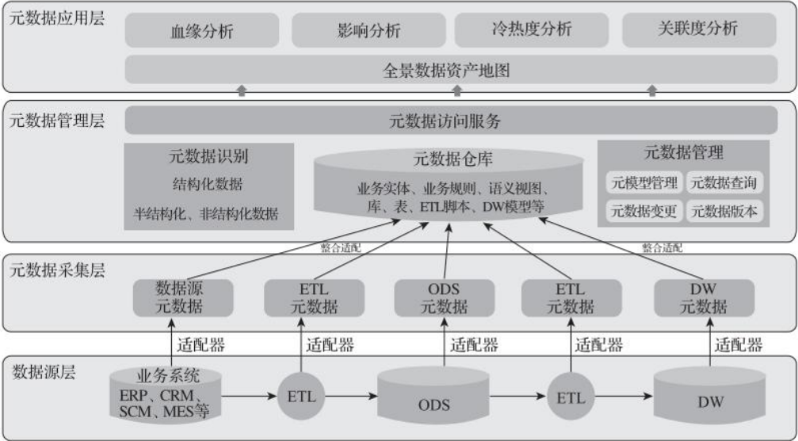
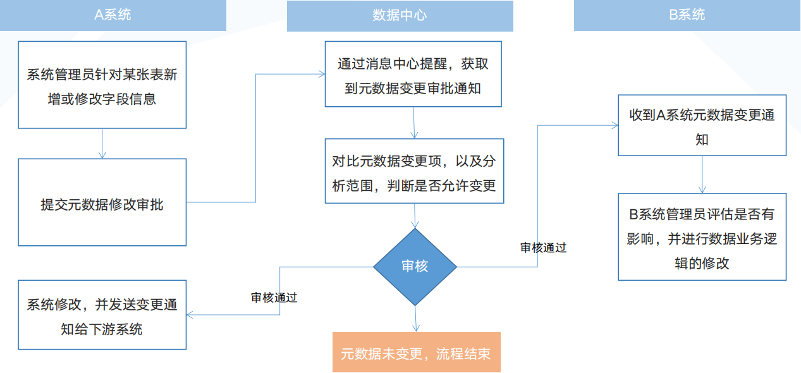
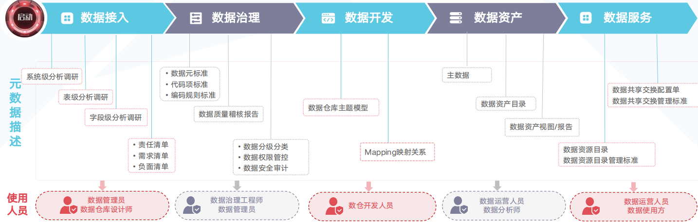
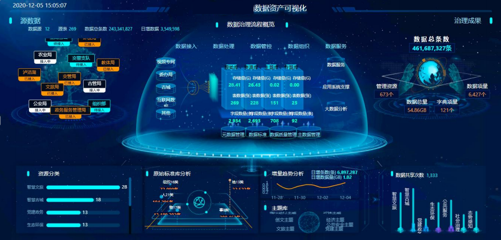
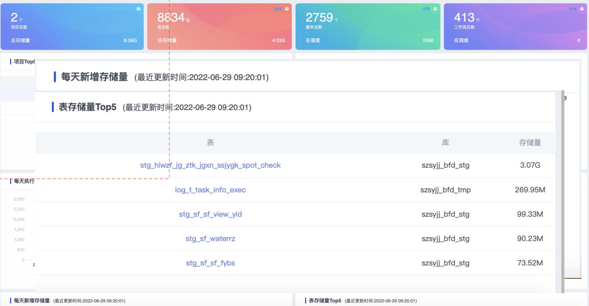

[TOC]

## 元数据概念

* 元数据：描述数据的数据
  * 例如在一座图书馆中，如果认为每一本书的内容都是数据，用来查找每一本书的索引就是元数据
    

> 元数据分类

通过技术元数据、业务元数据、管理元数据对数据进行描述

* 业务元数据
  * 对数据实体和数据处理的业务化描述，包括业务规则、业务术语、统计口径、信息分类等
* 技术元数据
  * 提供有关数据的技术细节、存储数据的系统以及在系统内和系统之间数据流转过程的信息
* 管理元数据
  * 描述了处理和访问数据的细节
  

## 元数据管理

> 元数据管理流程 

元数据采集 -> 元数据维护 -> 元数据审核 -> 元数据发布

> 元数据管理整体概览

> 元数据维护

* 元数据维护就是将采集的元数据进行补充维护，使描述的信息更完整，识别度更高
* 业务元数据一般无法自动自动获取，需要手动维护。部分管理元数据如数据权限也需要手动维护
  * 比如指标的统计口径, 加工方式都是人为进行设置并维护

> 元数据审核发布

元数据新增、变更的审核一般采用如下流程

## 元数据应用

> 元数据描述&应用

* 在数据治理的不同环节都需要不断的去收集描述元数据, 然后给下游或者其他环节去使用
* 举例子, 按图来说, 比如在数据接入的时候, 通过对业务/数据的盘点会产出比如表级分析, 字段级分析, 这些产出可以给数仓管理员做数仓设计

> 元数据应用--数据血缘

* 数据血缘是元数据的组成部分之一。它分析表和字段从数据源到当前表的血缘路径
* 数据血缘获取方式
  * SQL自动解析（Atlas）
  * 由数据处理程序负责发送数据血缘信息。例如在注解部分，增加对血缘的描述等
  * 手工收集，比如Mapping关系映射
* 血缘分析用途
  * 数据溯源
    * 当上层应用指标有异常时候可以通过血缘分析向下查找可能出问题的数据来源
  * 影响分析
    * 对某个核心元数据进行修改时通过血缘关系可以得到对下游有何影响
  * 冷热度分析
    * 哪些数据是企业常用数据，哪些数据属于僵尸数据，对不同数据采用不同存储访问方式
      * 僵尸数据（Zombie Data）是指那些在系统中仍然存在但已经不再使用、过时或不再相关的数据。这些数据可能由于多种原因没有被删除或归档
    * 比如可以通过前段网页点击访问的热度去判断哪些引用的表是热数据
  * 数据归档和销毁的参考
    * 对没有受众的数据进行归档或者停止对应脚本运行，节省系统资源
  
> 元数据应用--数据资产视图

能显示接入了哪些数据, 有多少数据量, 调度脚本有多少, 对外提供的资产目录等等信息
