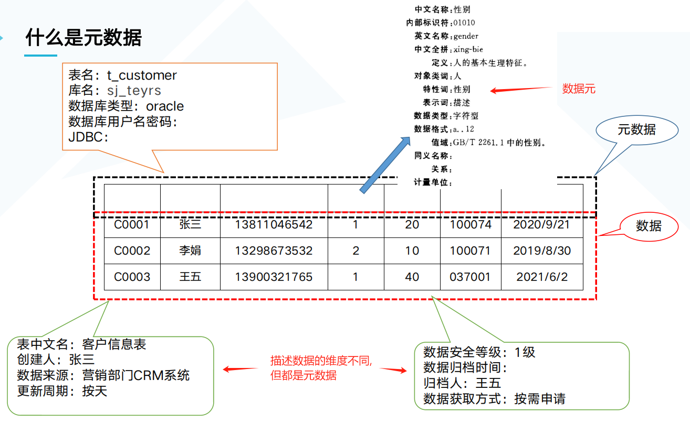
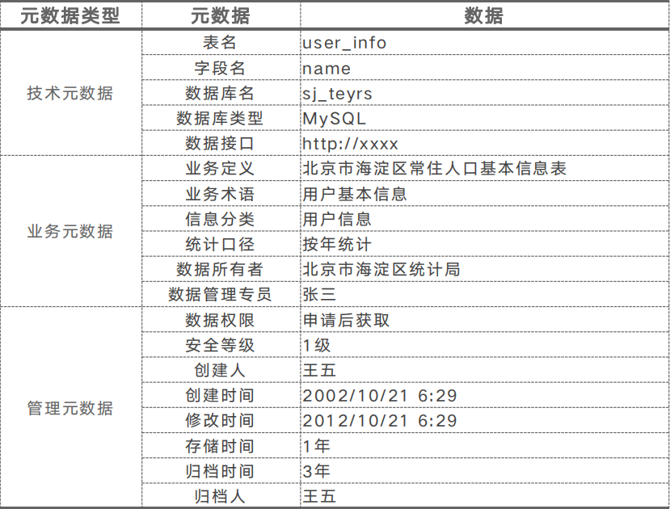

[TOC]

## 元数据概念

* 元数据：描述数据的数据
  * 例如在一座图书馆中，如果认为每一本书的内容都是数据，用来查找每一本书的索引就是元数据
    

> 元数据分类

通过技术元数据、业务元数据、管理元数据对数据进行描述

* 业务元数据
  * 对数据实体和数据处理的业务化描述，包括业务规则、业务术语、统计口径、信息分类等
* 技术元数据
  * 提供有关数据的技术细节、存储数据的系统以及在系统内和系统之间数据流转过程的信息
* 管理元数据
  * 描述了处理和访问数据的细节
  

## 元数据管理

## 元数据怎么用