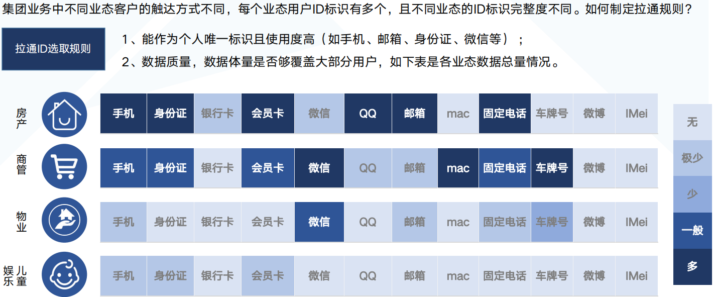
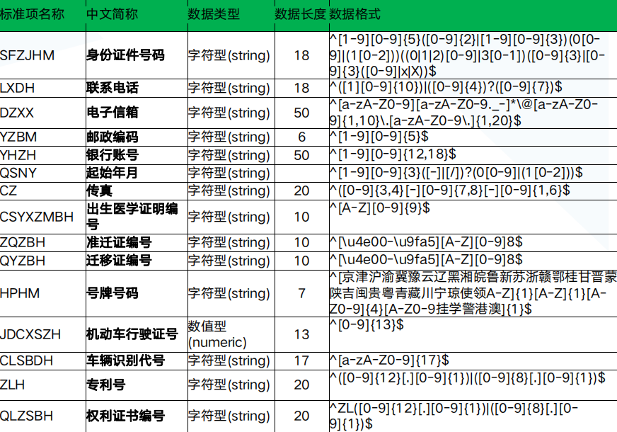
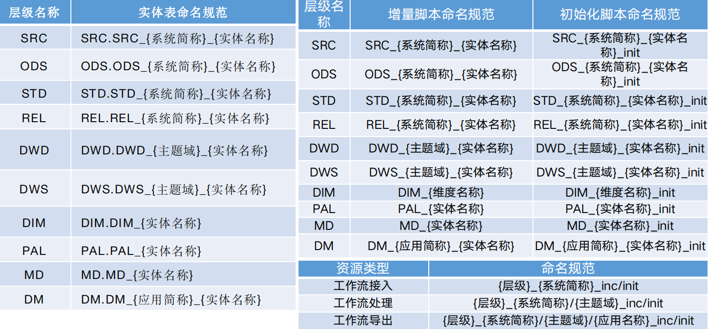
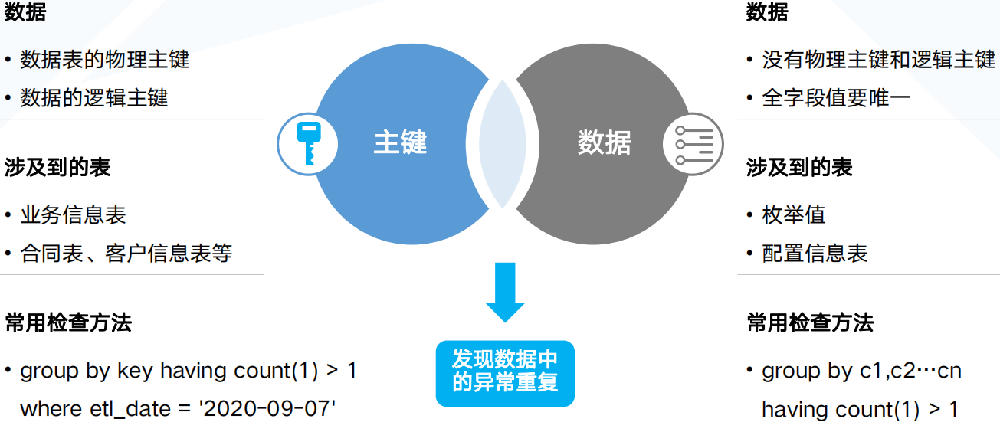
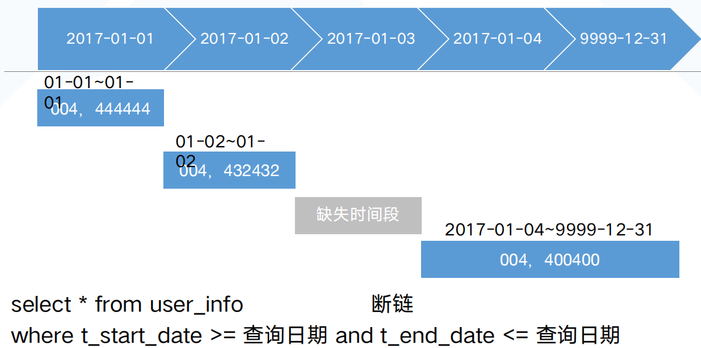
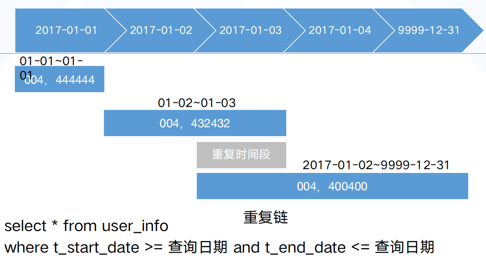

[TOC]

## 数据质量概述
### 目的

> 优化业务系统流程

比如发现数据库存储的手机号有各种各样的格式, 并没有统一格式, 那么可以猜测业务系统在录入手机号的时候并没有做比较好的格式校验, 这个时候可以反推给业务系统去优化该手机号录入的业务

> 数据处理依据

比如做用户id关联的时候, 用户的信息可能存在于多个系统, 那么用哪个系统的哪个用户标识来作为用户的全局id, 可以依据数据质量来做判定, 一般选择数据质量高, 数据体量能覆盖大部分用户的id来作为全局id

> 提升数据处理质量

就是说通过数据质量发现那些不规范的数据, 倒推上游的数据清洗阶段做改进, 从而提升数据质量

### 评估角度

> 4项数据标准稽核

* 数据元标准稽核
* 代码项标准稽核
* 编码规则标准稽核
* 命名/开发规范稽核

> 10大稽核规则

* 记录数规则
* 空值规则
* 唯一性规则
* 准确性规则
* 波动性规则
* 一致性规则
* 逻辑性规则
* 及时性规则
* 拉链表规则
* 自定义规则

## 数据标准稽核规则详解

### 数据元标准稽核

* 同一个中文对应不同英文，同一个英文对应不同的中文
* 字段是否包含在数据元标准范围内
* 数据类型是否和数据元标准保持一致
* 列名的comment不为空

### 代码项标准稽核

* 字段枚举值是否符合代码项标准

### 编码规则标准稽核

* 将编码规则标准转化成正则表达式去判断字段值是否符合标准

### 命名规范稽核

在做数据中台的过程中比如分层的命名, 脚本的命名等是否符合规范

## 稽核规则详解

### 记录数稽核规则

* 定义
    * 对表中的总记录数是否在设置的数值或范围内进行校验
* 稽核对象
    * 表级别
* 场景
    * 在数据接入环节校验数据接入的条数和业务系统中的数据量是否一致，避免丢失数据情况
    * 数据仓库中某张表的记录数是否在某个范围内, 比如：线索表中的每日新增数据量在1000-1200条记录数
    
### 空值稽核规则

* 定义
    * 对表中指定字段是否含有空值进行校验
* 稽核对象
    * 字段级
* 场景
    * 查找建表时不能为空字段为空的记录数（空字符串/null/NULL)
    * 统计关键字段的空值率（手机号、身份证号、微信号。。。）,评估数据质量
    

### 唯一性稽核规则

* 定义
    * 校验表中指定字段是否唯一
* 稽核对象
    * 字段级
    

### 准确性稽核规则

* 定义
    * 对表中指定字段是否含有空值进行校验
* 稽核对象
    * 字段级
* 场景
    * 数据的属性值符合预期逻辑要求。比如年龄、概率等
    
### 波动性稽核规则

* 定义
    * 对表的记录数或字段数据值对比之前的某个周期数据值的浮动趋势是否在一定范围内进行校验
* 稽核对象
    * 表级/字段级
* 场景
    * 接入数据量波动性，根据接入数据量的变化发现接入数据的异常，比如单表每日接入数据量2000W，上下波动5%算正常，超出此阈值报警
    * 根据数据值域波动性发现数据异常，比如账户余额
    
### 一致性稽核规则

* 定义
    * 对表间的数据是否一致进行校验
* 抽样数据一致性
    * 抽样部分数据 
    * 全字段比对 
    * 精度、空值 
    * 截断、串行
* 全量数据一致性
    * 全部数据比对
    * 全部数据导出成文件比对MD5
    * 需要注意null要做替换
    
### 逻辑性稽核规则

* 定义
    * 两张表间的字段逻辑是否相等或满足一定的关系运算进行校验，检查数据逻辑是否正确
* 稽核对象
    * 表级
* 场景
    * 比如合同表中的合同金额等于订单表的单价*建筑面积
    * 比如款项明细中某个合同号下的sum(款项金额）<=合同表中的合同金额
    
### 及时性稽核规则

* 定义
    * 检查单表数据更新时间是否在指定时间范围内
* 稽核对象
    * 表级
* 场景
    * 比如某张表的etl_date时间一般在夜里2：30左右，超出这个时间半小时发出告警
    
### 拉链表稽核规则

* 定义
    * 检查拉链表的数据是否有断链、重复链
    

### 自定义稽核规则

* 定义
    * 根据业务需求，自定义配置规则内容
* 稽核对象
    * 表级/字段级
* 场景
    * 超出以上规则的通过自定义写sql语句方式增加新的规则
    * 比如A表的某个字段值=B表的sum(某个字段值）+C表的某两个字段值