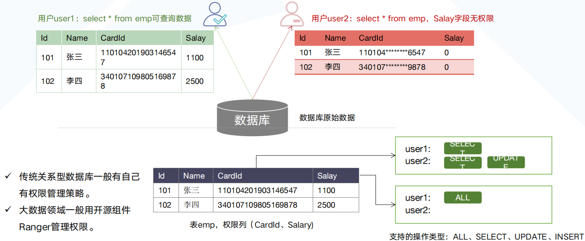

[TOC]

## 数据安全治理贯穿整个数据生存周期

## 数据生命周期安全框架

## 数据加密

* 数据安全登记特别高的数据比如二级,三级甚至以上的数据在做数据的写入或者传输的时候需要数据加密
* 常用加密算法有对称加密和非对称加密两种
  * 对称加密算法
    * 在加密和解密时使用相同的密钥，或是使用两个可以简单地  互相推算的密钥。对称加密的速度比  公钥加密快很多，加密算法有DES，  3DES，AES，Blowfish，IDEA，  RC5，RC6
  * 非对称加密算法
    * 就是说加密解密文件需要两个密钥，公钥用来加密，私钥用来解密。证书可以授权公钥的使用
* 国密算法
  * 简称国密，是国家密码局认定的国产密码算法，包括对称加密与非对称加密算法，常见于政府、央/国企等项目。主要有SM1，SM2，SM3，SM4
  

## 数据脱敏

* 数据脱敏（Data Masking），对某些敏感信息（比如，身份证号、手机号、卡号、客户姓名、客户地址、邮箱地址、薪资等等 ）通过脱敏规则进行数据的变形，进而屏蔽敏感数据，实现隐私数据的可靠保护，是一种对数据等级降级的方法(数据等级越高适用场景越少, 等级降级后可以在更多场景使用该数据)。数据脱敏是不可逆的。

## 数据分级分类

* 在进行数据分类分级后需要有针对性地制定数据防护要求，设置不同的访问权限、对重要数据进行加密存储和传输、敏感数据进行脱敏处理、重要操作进行审计记录和分析等

* 第一级
  * 数据受到破坏后，会对公民、法人和其他组织的合法权益造成损害，但不损害国家安全、社会秩序和公共利益
* 第二级
  * 数据受到破坏后，会对公民、法人和其他组织的合法权益造成严重损害，或对社会秩序和公共利益造成损害，但不损害国家安全
* 第三级
  * 数据受到破坏后，会对社会秩序和公共利益造成严重损害，或者对国家安全造成损害
* 第四级
  * 数据受到破坏后，会对社会秩序和公共利益造成特别严重损害，或者对国家安全造成严重损害
* 第五级
  * 数据受到破坏后，会对国家安全造成特别严重损害
  
> 以下为金融领域企业数据分级分类示例

## 数据权限管控

* 功能权限
  * 不同用户能访问的页面不同, 一般可以到页面按钮的粒度
* 数据权限
  * 不同用户能访问数据库的数据不同, 一般能到行, 列 级别
  
## 数据安全审计

