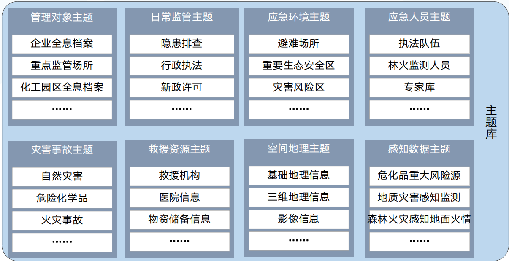
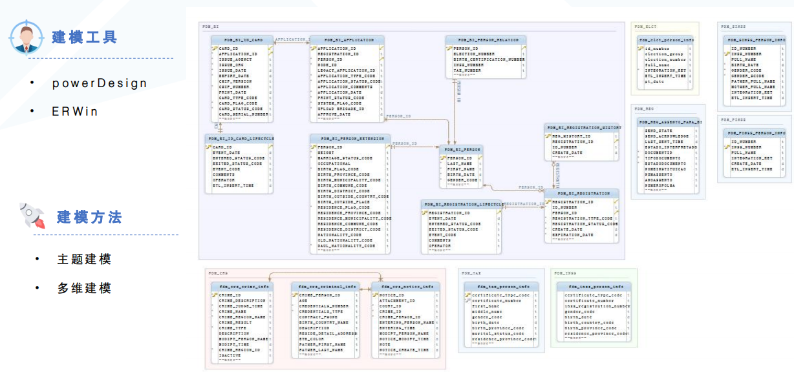

[TOC]

## 数据仓库概念

1. 数据仓库是能记录历史数据变化的。
2. 数据仓库是不同种类数据的集合，是集成的。
3. 数据仓库的数据都是分类保存，面向主题的。
4. 数据仓库和数据库不同，不是一个具体的产品而是一整个数据管理的过程及方法。

> 为什么建设数据仓库

* 未建设数仓
    * 直接对源表进行查询分析，查询慢、成本巨大，分析质量无法保障
    * 数据脏乱，数据质量差
    * 源系统繁多，烟囱式建设，无法进行高价值数据分析
* 建设数仓后
    * 可以在一个地方快速访问多个数据源数据，支撑快速的OLAP分析，响应快
    * 利于进行数据挖掘和数据分析
    * 提高数据的质量和一致性
    * 能够提供历史的数据
    

## 数据仓库建设流程

### 确定分层

> 为什么需要分层

* 处理灵活：随着业务的变化，只需要调整底层的数据，对应用层对业务的调整零感知
* 空间换时间：通过建设多层次的数据模型供用户使用，避免用户直接使用操作型数据，可以更高效的访问数据
* 问题简单化：将复杂任务分解成多个步骤，每层处理单一步骤即可，且便于数据维护，数据出现问题后修复相应步骤即可

### 确定主题

* 啥是主题域
    * 主题域通常是联系较为紧密的数据主题的集合。可以根据业务的关注点，将这些数据主题划分到不同的主题域。主题域的确定必须由最终用户和数据仓库的设计人员共同完成
* 为什么要设计主题域
    * 数据的划分更加清晰，可快速通过主题域的设计查找出实体间的关系
    * 提高用户在数据使用时的效率
* 基本上每个行业所包含的的主题域都已经固化
    * 比如零售行业主题
        * 销售主题：涉及商品销售数据，包括销售额、销售量、销售渠道等信息。
        * 库存主题：管理库存水平、库存流动和仓库操作等数据。
        * 顾客主题：包含顾客信息，如顾客人口统计数据、购买历史、忠诚度等。
        * 商品主题：涉及商品的详细信息，如商品描述、分类、价格、供应商等。
        * 供应链主题：包括供应链管理相关的数据，如采购、物流和配送。
        * 财务主题：涉及公司的财务数据，如收入、成本、利润和预算。
        * 市场主题：包含市场活动、广告投放效果和市场趋势分析等数据。
        * 流量主题：分析顾客流量和网站访问数据，如访问量、点击率等。
        * 用户行为主题：分析用户在零售平台上的行为模式和偏好。
        * 交易主题：记录交易的详细信息，如交易时间、支付方式、交易状态等
    * 政务行业
        * 
    * 环保行业
        * 
    * 应急行业
        * 

### 数仓建模

* dw层的构建过程, 有哪些主题, 每个主题里面有哪些表, 表里应该有哪些字段, 各个表的关联关系是咋样的, 这个过程叫数据建模

> 主题建模

* 主要针对DWD层

1. 业务建模
    * 解决业务层面的分解和程序化；充分理解客户业务数据和数据库设计；抽象实体
    * 就是从业务数据里抽象出实体, 比如政务行业里面的人口库主题抽象成更细化的自然人, 嫌疑人, 军人等实体
2. 领域建模
    * 分析主要实体间关系；对业务模型进行抽象处理，完善实体属性
    * 就是梳理实体有哪些属性, 比如军人有哪些属性是从a系统获取, 有哪些属性是从b系统获取
3. 逻辑建模
    * 将领域模型的概念实体以及实体之间的关系进行数据库层次的逻辑化
    * 就是构建各个实体的关系, 并且将各实体属性转化成字段, 标明字段类型, 来源等信息
4. 物理建模
    * 解决逻辑模型针对不同数据库的物理化以及性能相关问题, 最终生成DDL语句

> 多维建模

* 主要针对DWS层

1. 维度识别 
    * 和代码标准规范类似, 就是一个个枚举值
    * 需要列出需要使用到的维度
        * 定性维度
            * 时间
            * 地区
            * 性别
        * 定量维度
            * 年龄组
            * 收入水平
2. 指标识别 
   * 列出指标/度量
        * 人口数
        * 月收入
        * 企业数
        * 离网用户数
        * 新增用户数
3. 维表设计
    * 常用的维度表
        * 日期维度表
        * 行政区域维度表
        * 用房面积维度表
        * 电费档位维度表
        * 性别维度表
        * 年龄档位维度表
4. 确定粒度
        * 时间粒度
        * 行政区域粒度
        * 档位粒度
        * 考虑因素：
        * 业务需求
        * 存储量
        * 开发复杂程度
5. 事实表设计
        * 比如现在要设计一个电费账单业务
            * 确定数据分析粒度
                * 月度、机构
            * 确定相关维度
                * 机构维、机构状态维…
            * 确定相关指标
                * 账单电费、应收电费、实收电费
6. 回顾审核
    * 
### ETL加工

> MAPPING设计

相当于是做一个详细设计, 比如都要创建哪些表, 表字段哪里来, 属性意思是什么, 各个表之间的where条件是什么

> 脚本开发

就是将上面mapping设计产出的详细设计文档变成ETL加工脚本
### 工作流调度

将脚本通过工具调度起来

## 数据仓库设计规范

