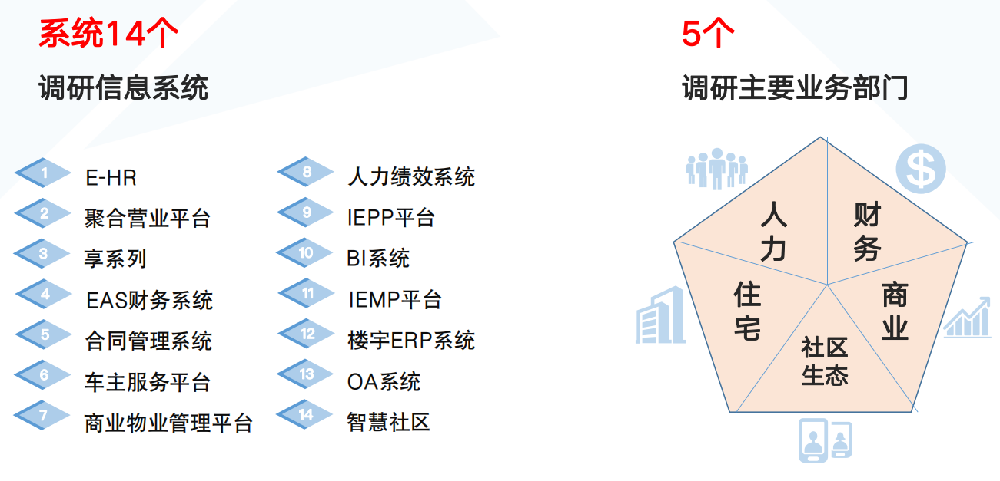

[TOC]

## 主数据概述

> 主数据是什么

主数据（MD，Master Data）指存在于2个或2个以上系统间的数据，例如客户数据、产品数据等，能帮助企业构建单一、准确、权威的数据来源

如图, 主数据对应一个主数据库, 他存储了客户信息或者其他信息, 当CRM系统修改客户信息时, 会将修改请求发送到主数据库, 主数据库修改完后会通知其他系统

> 搭建主数据的目的

解决数据在不同系统间的一致性问题

> 主数据和数据仓库的关系

* 共性
    * 价值相同
        * 减少数据冗余和不一致性、提升对数据的洞察力，都是跨部门的集中式系统；
    * 处理方式相同
        * 涉及 ETL 技术、元数据管理、数据
      质量；
        * 建设模式相同，数据治理规范作为指导；需不同系统、不同部门的协作
* 区别
    * 信息流向
        * 数据仓库 -> 单向
            * 数仓从业务系统获取数据后只需要对外提供分析的结果, 不会影响回业务系统的数据 
        * 主数据管理 -> 双向
            * 就是说主数据的数据是从业务系统中获取, 如果发生变化, 还要通知到其他业务系统 
    * 分发  
        * 数据仓库 -> N/A
            * 数仓输出的报表不会影响业务系统的数据, 所以不存在对业务系统做数据分发的这个过程 
        * 主数据管理 -> 发布
    * 数据量
        * 数据仓库 -> 所有数据
        * 主数据管理 -> 部分数据
            * 主数据库里面的数据是存在于两个或者两个以上系统的, 所以和数据仓库相比是部分数据, 而不是像数据仓库一样是相对全面的数据
    * 实时性
        * 数据仓库 -> 较低
        * 主数据管理 -> 较高
    * 主数据严格意义上一个业务上的系统, 而数据仓库是一个面向分析的系统
    
主数据如果构建完成后, 他的数据可以作为数据仓库的一个数据来源, 如果数据仓库先构建, 那么主数据的初始化也可以从数据仓库中识别并获取

## 主数据典型场景

## 主数据建设路径

以地产行业为例, 主数据建设流程一般分为两个部分: 主数据初始化和主数据运营

### 主数据初始化

> 主数据调研分析

调研主要业务部门所使用到的信息系统

> 主数据识别

将存在于两个或者两个以上的核心数据识别为主数据

> 主数据标准制定

* 数据标准
    * 
    * 比如对于某个物料, 各个部门所涉及到的属性不一样, 这个时候就需要汇总所有的物料属性称为物料全属性库, 然后不同属性的更新维护属于不同的具体部门
    * 定来源
        * 就是确定主数据初始化之后, 他的维护是由哪个业务系统来维护, 尽量定位一个业务系统来维护, 多头维护会造成数据混乱
        * 像库存数据不能确定唯一来源的主数据也不要紧, 大部分主数据能确定唯一出处即可
* 集成标准
    * 就是数据发生变化怎么通知主数据系统, 这个过程叫数据上报, 所以需要规定数据上报的接口规范是什么, 格式是什么, 然后主数据怎么分发到其他系统
* 管理标准
    * 
    * 哪些人可以去改哪些主数据, 改了之后需要有哪些审批环节
    

> 主数据数据模型构建

比如主数据的用户属性来源于多个业务系统, 这里需要进行属性合并成大宽表

> 主数据采集接入

 
> 主数据质量校验

> 主数据数据标准化

###  主数据运营

> 主数据管理流程

主数据的维护和审核需要定义清晰的流程规范。特别是对主数据的创建，变更和使用流程的定义。

> 主数据维护

大部分使用共存模式, 因为这种模式对于其他业务系统的改造较小

> 主数据分发

* MDM通过REST接口服务完成集中的数据分发，包括分发路由都通过接口调用完成
* MDM通过统一网关本身的消息发布/订阅模式，实现数据的实时/增量分发
* MDM对数据的分发既可以主动推送，也可以是业务系统主动定时查询同步

